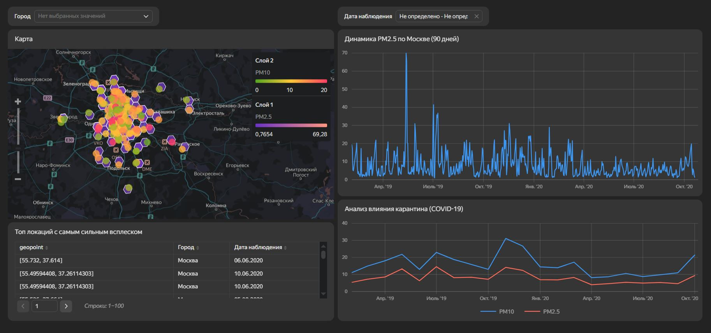
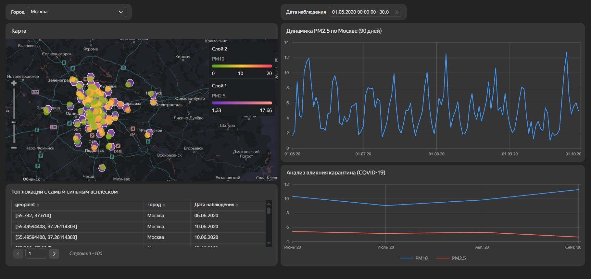

# Анализ качества воздуха в Москве и Санкт-Петербурге

## О проекте

Интерактивный дашборд для мониторинга качества воздуха в двух крупнейших городах России — Москве и Санкт-Петербурге. Проект позволяет наглядно оценить экологическую обстановку, отследить динамику загрязнения и увидеть, как внешний фактор (пандемия) повлияли на состояние воздуха.

## Используемые инструменты и технологии

- **Yandex DataLens**: построение дашборда, визуализация данных;
- **ClickHouse**: база данных, в которой хранятся исходные данные о качестве воздуха;
- Подключение к данным осуществлялось напрямую из DataLens через указание параметров подключения к ClickHouse.

## Структура дашборда

Дашборд включает несколько блоков для комплексного анализа:

- **Интерактивная карта**: распределение уровня загрязнения по районам Москвы и Санкт-Петербурга (визуализация по геоточкам);
- **График динамики качества воздуха**: отображает изменения показателей за выбранный период времени;
- **Анализ влияния ковидных ограничений**: на графике наглядно видно улучшение качества воздуха в период пандемии;
- **Топ сильных всплесков загрязнения**: таблица с аномалиями.

## Как работает подключение к данным

Данные для дашборда хранятся в облачной базе ClickHouse. Подключение к ним выполнено через стандартный коннектор Yandex DataLens: в интерфейсе указаны хост, порт, логин и пароль, после чего данные становятся доступны для построения чартов.

## Результат

Дашборд позволяет:
- Быстро оценить экологическую ситуацию в двух городах;
- Отследить влияние карантинных мер на окружающую среду.

## Скриншоты

## Ссылка на дашборд

[Смотреть дашборд в Yandex DataLens](https://datalens.yandex/2fq9lzjd75lkm?_share_link=public)

