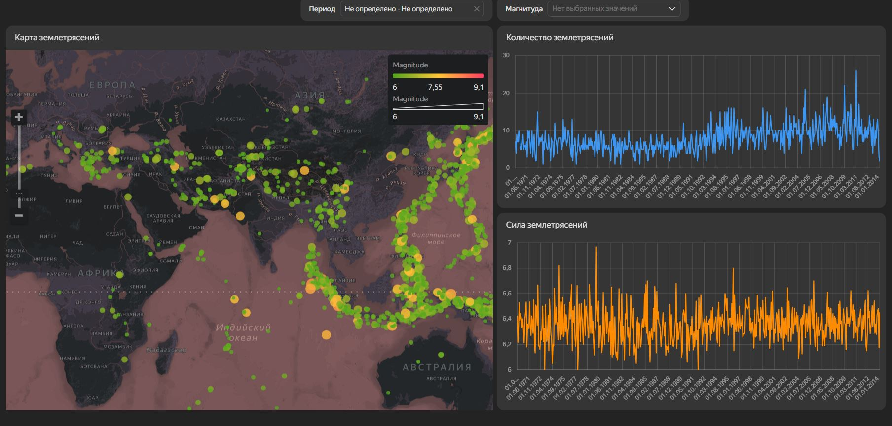
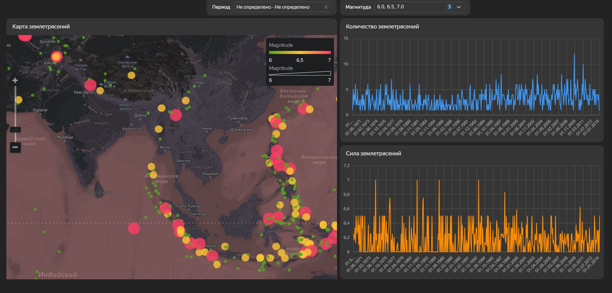

# Анализ глобальной сейсмической активности (1970–2014)

## О проекте

Интерактивный дашборд для визуализации и анализа данных о землетрясениях по всему миру. Проект позволяет оценить пространственное распределение сейсмических событий, их частоту и силу в разные временные периоды.

## Используемые инструменты и технологии

- **Yandex DataLens**: построение дашборда, визуализация данных;
- **Excel**: формат исходных данных;
- **Kaggle**: платформа с открытыми датасетами.

## Данные

В качестве источника использовался открытый датасет с платформы Kaggle, содержащий данные о землетрясениях по всему миру за период с 1970 по 2014 год.

**Ссылка на датасет:**  
[https://www.kaggle.com/datasets/alexisbcook/geospatial-learn-course-data?select=earthquakes1970-2014.csv](https://www.kaggle.com/datasets/alexisbcook/geospatial-learn-course-data?select=earthquakes1970-2014.csv)

Датасет содержит информацию о:
- Времени события (DateTime);
- Географических координатах (Latitude, Longitude);
- Магнитуде землетрясения (Magnitude);
- Глубине очага (Depth);
- Источнике регистрации.

## Подготовка данных

Для работы с геопространственными данными в Yandex DataLens были выполнены следующие шаги:

- Поля **Latitude** и **Longitude** объединены в единое вычисляемое поле **geopoint** с помощью функции `GEOPOINT` и присвоен тип данных «Геоточка»;
- Для числовых полей (Magnitude, Depth) проверен и установлен корректный тип «Дробное число»;
- Поле DateTime оставлено для временной агрегации.

## Структура дашборда

Дашборд включает несколько блоков для комплексного анализа:

- **Интерактивная карта**: отображает эпицентры землетрясений по всему миру; размер точки зависит от магнитуды, цвет — от силы (градиент от зеленого к красному); при наведении отображается всплывающая подсказка с деталями (дата, магнитуда, глубина);
- **Линейная диаграмма (количество)**: показывает число зафиксированных землетрясений по годам (агрегация COUNT уникальных EventID);
- **Линейная диаграмма (сила)**: отражает динамику средней магнитуды землетрясений по годам;
- **Селекторы**: позволяют фильтровать данные по временному периоду и магнитуде.

## Результат

Дашборд позволяет:

- Визуально оценить сейсмическую активность в разных регионах мира;
- Отследить динамику количества и силы землетрясений за 44 года;
- Выявить регионы с наибольшей сейсмической опасностью;
- Фильтровать данные по временному периоду и магнитуде для углубленного анализа.

## Скриншот дашборда

## Ссылка на дашборд

[Смотреть дашборд в Yandex DataLens](https://datalens.yandex/r4grmi9wdx2eb?_share_link=public)
