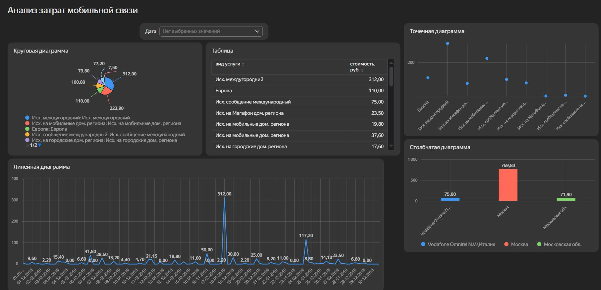

# Анализ расходов на мобильную связь (Мегафон)

## О проекте

Интерактивный дашборд для анализа структуры расходов на мобильную связь. Проект построен на основе реальных данных о звонках абонента, позволяет визуализировать затраты по различным категориям и отслеживать динамику расходов.

## Используемые инструменты и технологии

- **Yandex DataLens**: построение дашборда, визуализация данных;
- **Microsoft Excel**: хранение и первичная подготовка исходных данных;
- Данные загружались в DataLens из Excel-файла.

## Данные

В качестве источника использовался файл Excel с детализацией расходов на мобильную связь оператора Мегафон.

Датасет содержит информацию о:
- Суммах расходов по категориям звонков;
- Типах звонков (междугородние, на мобильные/городские номера, внутри региона и др.);
- Временной динамике расходов.

## Структура дашборда

Дашборд включает несколько блоков для комплексного анализа:

- **Круговая диаграмма**: показывает структуру расходов по категориям звонков (междугородние, на мобильные номера, на городские номера, внутри региона);
- **Столбчатая диаграмма**: отражает общую сумму расходов и распределение по месяцам;
- **Линейная диаграмма**: позволяет отследить динамику расходов во времени, заметить сезонные колебания и аномалии;
- **Таблицы с детализацией**: выводят конкретные суммы для каждой категории.

## Что можно увидеть на дашборде

- На какие категории звонков тратится больше всего денег;
- Как меняются расходы по месяцам;
- Есть ли выраженная сезонность;
- Какие типы звонков требуют оптимизации.

## Скриншот дашборда

## Ссылка на дашборд

[Дашборд в Yandex DataLens](https://datalens.yandex/kuj064xrybv84?_share_link=public)
